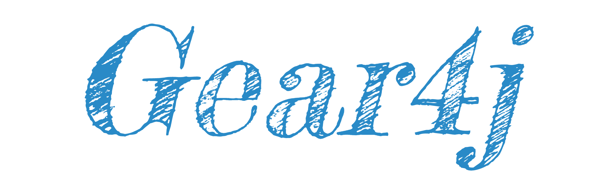

	
    <strong>Spring Boot快速开发助手，Spring Cloud 微服务开发核心包</strong>

 

简体中文 | [English](README_EN.md)

## 简介

`Gear4j`定位是Spring Boot快速开发助手及Spring Cloud 微服务开发核心包。`Gear4j`提供了缓存、安全框架以及主流产商云服务快速集成能力。
基于`Gear4j`可以不用关注技术细节快速搭建高并发高可用基于微服务的分布式架构。

### 发展历程 `Sabre` → `Chaos` → `Gear4j`

1. 从入行到实习之前，自己沉淀了不少工具类，所以在2017年发布第一版取名叫Sabre。原本只有自己在使用，后来有同学用了这个工具类感觉说比较好用，因此发布此工具到Maven中央仓库。
2. 在实习时，接触了不同的业务，再加上国内SpringBoot刚不断推广。因此工具类基于SpringBoot做了整体重构，故改名为`Chaos`
3. 随着微服务的逐渐发展，我发现`Chaos`有点不满足我的需求，因此打算调整`Chaos`的方向，准备向分布式架构及云原生架构发展，故改名为`Gear4j`

	

### 定位

- 寓意：Gear（超级轮子），解决各种框架整合、各种场景的融合的问题、形成一整套完全自洽的解决方案
- 理念：融合、增强、包容、自洽
- 原则：贴近业务场景只做有用的功能

### 👥 仓库地址

- [Github](https://github.com/gclm/gear4j)
- [Gitee](https://gitee.com/gclm/gear4j)

> Gitee 是同步的镜像仓库，有问题请使用 Github Issue 反馈

### 🏷️ 版本号说明

本项目遵循[语义化版本 2.0.0](https://semver.org/lang/zh-CN/)

- `release` 版本号格式为 `x.x.x`
- `snapshots` 版本号格式为 `x.x.x-SNAPSHOT`

> `snapshots` 版本 `push` 后会自动发布，及时响应修复最新的 `bug` 和需求。

### 📝 使用文档

**使用文档**详见：[https://dandelion.gclmit.club/pages/9cf655/](https://dandelion.gclmit.club/pages/9cf655/)

**更新记录**详见：[Chaos 更新记录](CHANGELOG.md)

### 📱 沟通交流

- Issues交流：[https://github.com/gclm/gear4j/issues](https://github.com/gclm/gear4j/issues)
-
QQ群交流：[641633175](https://shang.qq.com/wpa/qunwpa?idkey=4684b1c1194706adcc4ce7c9428935d31c0b2a86b51e96cb807fa30f94cebfde)

### 🧐 赞赏

### 💚 鸣谢

- 感谢 JetBrains 提供的非商业开源软件开发授权
- Thanks for non-commercial open source development authorization by JetBrains

